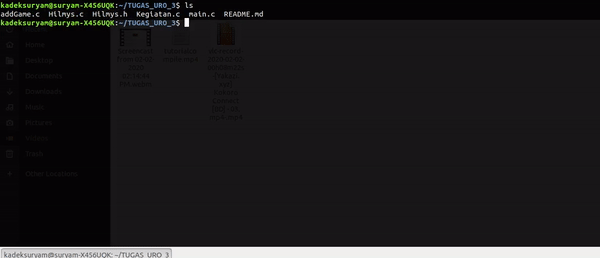

# Hilmys's Life

Game ini merupakan game simulasi kehidupan Hilmys.

### Prerequisites

How to Compile and Run in Linux or Mac OS

```
 $ gcc addGame.c Hilmys.c Hilmys.h Kegiatan.c main.c -o main
 $ ./main
```


## Authors
| Nama Anggota Kelompok               | Jurusan dan Fakultas | NIM      |
|-------------------------------------|----------------------|----------|
| I Wayan Ananta Wijaya Muji Suandira | TPB STEI             | 16519311 |
| Kadek Surya Mahardika               | TPB STEI             | 16519444 |
| Yudi Alfayat                        | TPB STEI             | 16519450 |

## License

This project is licensed under the MIT License - see the [LICENSE](LICENSE) file for details


